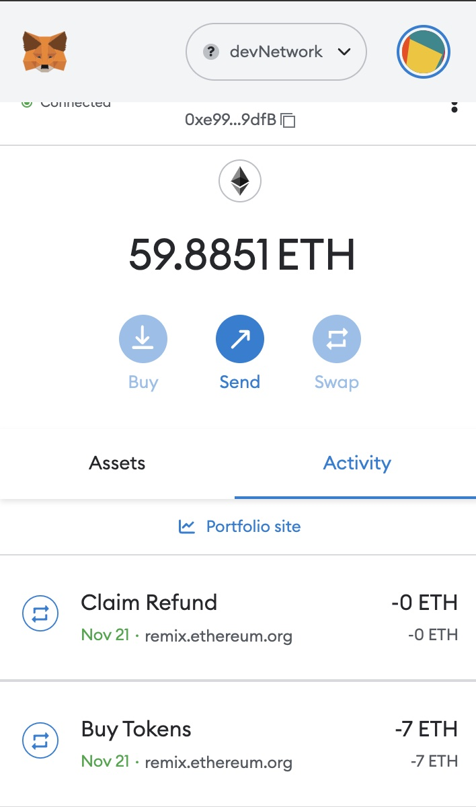

# WE-Shop-Marketplace

## WE Stand Together For Women Empowerment! 

### Project Overview:
We will be creating a decentralized marketplace where users will be able to buy, sell, and auction items. 

This marketplace will be value-centered - all purchases and items will contribute to women’s charities both here and abroad - https://www.neemaproject.org/

We will launch a crowdsale to fund Neema Project, a small nonprofit in Kenya that works to break the cycle of extreme poverty by offering skills training to young women. Our goal is to raise 400 ETH from this crowdsale by minting ERC 20 tokens with the help of open zeppelin in solidity. To achieve this , we’ll use advanced solidity concepts to create a crowdsale of new token called ”Kikecoin”. The token will allow you to purchase items in the marketplace.

## Tech Stack:
* Version control: Github, Google Docs 

* Front-end and Deployment: Streamlit

* Programming Languages: Python, Solidity

* Presentation: Canva deck followed by Streamlit and crowdsale contract demo
* Development tools: Remix IDE, Jupyter Notebook, Visual Studio

* Blockchain tools: Ganache, Metamask,Open Zeppelin(ERC20,ERC20Detailed,ERC20Mintable, CappedCrowdsale, TimedCrowdsal, RefundablePostDeliveryCrowdsale)

### Coding the crowdsale smart contracts

We have created and compiled 3 smart contracts for ths crowdsale:

1. KikeCoin:This cntract is responsible for creating our KikeCoin token.Initial supply is 0, tokens will be minted as funds are raised.This can be varified by clicking the totalsupply button of the contract.

2. KikeCoinCrowdsale:This contract allows us to buy tokens,check balance, finalize the crowdsale, goal reached and cliaim refunds among other functionality. It distributes tokens after the crowdsale has finished, letting users call withdrawTokens in order to claim the tokens they’ve purchased.

3. KikeCoinCrowdsaleDeployer:This contract is a helper contract to setup, configure and deploy our KikeCoin and KikeCoinCrowdsale contracts.It creates two contract addresses: 1 for the token address and another for the token sale address that used to deploy both the contracts.

Note that to fill in the cap and goal parameters, WE used this ETH converter https://eth-converter.com to convert 400 ETH to wei.

### Deployment steps:

* clone repo
* open remix https://remix.ethereum.org/
* install and open ganache
* install and open metamask

* Under networks in metamask add a new rpc network, name it devnetwork and input the following as seen in ganache quick start into the devnetwork fields. NETWORK ID = 5777 RPC SERVER = HTTP://127.0.0.1:7545

* save network in metamask and then grab several private keys from the ganache accounts and import those into the metamask devnetwork.

* In remix copy the solidity code from the file named KikeCoin.sol and KikeCoinCrowdsale.sol

* Compile the contract code with the corresponding compiler version

* Deploy KikeCoinCrowdsale.sol by choosing the KikeCoinSaleDeployer contract from the contract dropdown. Fill in the fields for Name (KikeCoin), Symbol(We chose "KC" for this example) and Wallet (This will be the beneficiary of the sale and can be any address that you choose),in the goal text box fill your amount in tokenbits (in our case, it's 400000000000000000000, i.e. 400 ether) then click on transact. This should generate two contract addresses when you click on the button for token address and token crowdsale address.

* Go back to the contract deployment section, choose the KikeCoinSale function from the dropdown, then copy and paste the crowdsale_address from the the previous step into the "At Address" field and click on the "At Address" button. This should generate your KikeCoin Crowdsale contract below the first contract.

* Go back to the contract deployment section, choose the KikeCoin contract from the dropdown, then copy and paste the token_address from the the previous step into the "At Address" field and click on the "At Address" button. This should generate your 3rd and final contract, the KikeCoin contract.

Below are the screenshots of the deployed smart contracts:

## Functionality Testing of the deployed contract

### Buying Tokens

* You will need some ETH first. You can get it from Ganache.

* To buy tokens, input the amount of tokens that you want to buy in the "Value" field of Solidity (Note that we have a 1:1 exchange rate of ETH to KC token), then put the wallet address of the token buyer in the buyToken field of the KikeCoin sale contract.Make sure to connect this account with Metamask. See video below:

Below you can see the successful transaction hash along with the confirmation from MetaMask. You can also view this yourself in Ganache.

Below is a screenshot of our target account's balance. We can see that the target balance has 90 token which we purchased for 90 ETH [1000000000000000000 TKNbits is equal to 1 TKN]

## To reach the target goal we made some more trasactions from different accounts. 

### Account Balance

## Reached Cap Limit

## Finalizing the Crowdsale and Getting Refunds

Once the goal amount of ETH is raised which in this illustration is 100 ETH we can use the finalize function to close the crowdsale. Using the ``isOpen`` function which returns a True/False statement, we can check whether the crowdsale is open or closed. The finalize function will only work once the crowdsale is closed. The screenshot below shows that our crowdsale has been finalized.

 If the goal is not reached anyone who has bought tokens can also use the ``claimRefund`` function to refund their ETH.

We further extended our Kikecoin crowdsale contract to enahance its functionality by adding OpenZeppelin  **Whitelist** contract.This will allow whitelisted participants to purchase tokens. This is useful for putting KYC / AML whitelist on-chain!

Below is the screenshot of our deployed WhitelistCrowdSale smart contract:

## Collaborators:
Quianna Rolston - https://github.com/qrolston

Smruthi Danda - https://github.com/smruthid

Lujunjin Liu - https://github.com/liulujunjin-vivian

Manisha Lal - https://github.com/2004-ind

Zehra Vahidy - https://github.com/zvahidy

Github Repository: https://github.com/zvahidy/WE-Shop-Marketplace.git
